<!-- TOC -->

- [1. Definitions](#1-definitions)
- [2. Amazon EC2](#2-amazon-ec2)
  - [2.1. Instances](#21-instances)
  - [2.2. Purchase Options](#22-purchase-options)
  - [2.3. Scaling Options](#23-scaling-options)
  - [2.4. Elastic Load Balancing (ELB)](#24-elastic-load-balancing-elb)
  - [2.5. Messaging and queueing](#25-messaging-and-queueing)
  - [2.6. Amazon Simple Queue Service (SQS).](#26-amazon-simple-queue-service-sqs)
  - [2.7. Amazon Simple Notification Service (SNS)](#27-amazon-simple-notification-service-sns)
- [3. Serverless Compute Infra](#3-serverless-compute-infra)
  - [3.1. AWS LAMBDA](#31-aws-lambda)
  - [3.2. Containers](#32-containers)
- [4. AWS Global Infrastructure](#4-aws-global-infrastructure)
  - [4.1. Regions](#41-regions)
  - [4.2. Availability Zones](#42-availability-zones)
  - [4.3. Data Centres](#43-data-centres)
  - [4.4. Edge Locations](#44-edge-locations)
  - [4.5. Provisioning Resources](#45-provisioning-resources)

<!-- TOC -->
- [AWS Cloud Practitioner Essentials](#aws-cloud-practitioner-essentials)
  - [Definitions](#definitions)
- [Compute in the Cloud](#compute-in-the-cloud)
  - [Amazon EC2](#amazon-ec2)
    - [Instances](#instances)
    - [Purchase Options](#purchase-options)
    - [Scaling Options](#scaling-options)
      - [Auto Scaling](#auto-scaling)
        - [Auto Scaling group](#auto-scaling-group)
    - [Elastic Load Balancing (ELB)](#elastic-load-balancing-elb)
    - [Messaging and queueing](#messaging-and-queueing)
    - [Amazon Simple Queue Service (SQS).](#amazon-simple-queue-service-sqs)
    - [Amazon Simple Notification Service (SNS)](#amazon-simple-notification-service-sns)
  - [Serverless Compute Infra](#serverless-compute-infra)
    - [AWS LAMBDA](#aws-lambda)
    - [Containers](#containers)
      - [Elastic Container Service (ECS)](#elastic-container-service-ecs)
      - [Amazon Elastic Kubernetes Service (Amazon EKS)](#amazon-elastic-kubernetes-service-amazon-eks)
      - [Amazon Fargate](#amazon-fargate)
- [Global Infra and reliability](#global-infra-and-reliability)
  - [AWS Global Infrastructure](#aws-global-infrastructure)
    - [Regions](#regions)
    - [Availability Zones](#availability-zones)
    - [Data Centres](#data-centres)
    - [Edge Locations](#edge-locations)
    - [Provisioning Resources](#provisioning-resources)
      - [1- AWS Management Console](#1--aws-management-console)
      - [2- AWS CLI](#2--aws-cli)
      - [3- AWS SDK](#3--aws-sdk)
      - [4- Other tooling](#4--other-tooling)
        - [Elastic Beanstalk](#elastic-beanstalk)
        - [CloudFormation](#cloudformation)

# AWS Cloud Practitioner Essentials
## Definitions
| Term                          | Definition                                                                 |
|-------------------------------|----------------------------------------------------------------------------|
| AWS (Amazon Web Services)     | A comprehensive and evolving cloud computing platform provided by Amazon. |
| Cloud Computing               | The on-demand delivery of IT resources over the Internet with pay-as-you-go pricing. |
| Region                        | A geographical area containing multiple AWS Availability Zones.           |
| Availability Zone (AZ)        | One or more discrete data centers with redundant power and networking.    |
| Edge Location                 | A site that AWS uses to cache content closer to users, used in services like CloudFront. |
| IAM (Identity and Access Management) | A service for managing access to AWS services and resources securely.  |
| EC2 (Elastic Compute Cloud)   | A web service that provides resizable compute capacity in the cloud.       |
| S3 (Simple Storage Service)   | An object storage service that offers scalability, data availability, and security. |
| RDS (Relational Database Service) | A managed relational database service supporting multiple database engines. |
| Lambda                        | A serverless compute service that runs code in response to events.        |
| CloudFormation                | A service for modeling and setting up AWS resources using templates.      |
| Auto Scaling                  | A service that automatically adjusts compute capacity to maintain performance. |
| Elastic Load Balancing (ELB)  | A service that automatically distributes incoming application traffic.    |
| AWS Global Infrastructure     | The physical components (Regions, AZs, Edge Locations) of AWS.            |
| CloudFront                    | A fast content delivery network (CDN) service.                            |
| AWS Trusted Advisor           | A tool that provides real-time guidance to help provision resources.      |
| AWS Well-Architected Framework | A set of best practices to help build secure, high-performing, resilient, and efficient infrastructure. |
| Pricing Calculator            | A tool for estimating the cost of AWS services.                          |
| Support Plans                 | Tiered support offerings for AWS customers (Basic, Developer, Business, Enterprise). |
| Shared Responsibility Model   | A model defining AWS and customer responsibilities in the cloud.          |
| Hypervisor                    | Software that creates and runs virtual machines by abstracting hardware resources. |
| Tenant                        | A single customer or user group using a shared computing resource.         |
| Multitenancy                  | An architecture where multiple tenants share the same physical resources while maintaining data isolation. |

# Compute in the Cloud
## Amazon EC2
Amazon EC2, is a service that lets you run virtual servers in the cloud. If you have applications that you want to run in Amazon EC2, you must do the following:

1- Provision instances (virtual servers).

2- Upload your code.

3- Continue to manage the instances while your application is running.

If you are only interested in the Application part, and dont want to manage the infra this is [Serverless Compute Infra](#serverless-compute-infra).

### Instances
**General Pupose** : General purpose instances provide a balance of compute, memory, and networking resources. This instance family would not be the best choice for the application in this scenario. Compute optimized instances are more well suited for batch processing workloads than general purpose instances.

**Memory optimized** instances are more ideal for workloads that process large datasets in memory, such as high-performance databases.

**Storage optimized** instances are designed for workloads that require high, sequential read and write access to large datasets on local storage. The question does not specify the size of data that will be processed. Batch processing involves processing data in groups. A compute optimized instance is ideal for this type of workload, which would benefit from a high-performance processor.

**Compute optimized** instances are ideal for compute bound applications that benefit from high performance processors. Instances belonging to this category are well suited for batch processing workloads, media transcoding, high performance web servers, high performance computing (HPC), scientific modeling, dedicated gaming servers and ad server engines, machine learning inference and other compute intensive applications.

**Accelerated Computing** 
Accelerated computing instances use hardware accelerators, or co-processors, to perform functions, such as floating point number calculations, graphics processing, or data pattern matching, more efficiently than is possible in software running on CPUs.

**HPC Optimized**
High performance computing (HPC) instances are purpose built to offer the best price performance for running HPC workloads at scale on AWS. HPC instances are ideal for applications that benefit from high-performance processors such as large, complex simulations and deep learning workloads.

### Purchase Options
| Plan                          | Definition                                                                 |
|-------------------------------|----------------------------------------------------------------------------|
| On Demand     | Pay per hour/sec, this can provide you with a baseline. no longterm commitment |
| Savings Plan    | Low prices with hourly spend commitment for 1 or 3 year term (save 72%) |
| Standard Reserved Instance | Steady state workloads. This option is a good fit if you know the EC2 instance type and size you need for your steady-state applications and in which AWS Region you plan to run them. 3 payment options(full, partial, no upfront cost). Reserved Instances require a contract length of either 1 year or 3 years. (save up to 75%) |
| Convertable Reserved Instance | Steady state workloads. If you need to run your EC2 instances in different Availability Zones or different instance types. 3 payment options(full, partial, no upfront cost), (save up to 75%) |
| Spot Instances | AWS provide 2min warning before reclamation (save up to 90%) |
| Dedicated hosts | Physical servers with Amazon EC2 instance capacity that is fully dedicated to your use. (Most expensive) and run in a Virtual Private Cloud(VPC) |

### Scaling Options
Scalability involves beginning with only the resources you need and designing your architecture to automatically respond to changing demand by scaling out or in. As a result, you pay for only the resources you use. You don’t have to worry about a lack of computing capacity to meet your customers’ needs.
| Plan                          | Definition                                                                 |
|-------------------------------|----------------------------------------------------------------------------|
| Dynamic scaling    | Responds to changing demand. |
| Predictive scaling    | Automatically schedules the right number of Amazon EC2 instances based on predicted demand. |

#### Auto Scaling
In the cloud, computing power is a programmatic resource, so you can take a more flexible approach to the issue of scaling. By adding Amazon EC2 Auto Scaling to an application, you can add new instances to the application when necessary and terminate them when no longer needed.

##### Auto Scaling group
When you create an Auto Scaling group, you can set the minimum number of Amazon EC2 instances. The minimum capacity is the number of Amazon EC2 instances that launch immediately after you have created the Auto Scaling group. In this example, the Auto Scaling group has a minimum capacity of one Amazon EC2 instance. You pay for only the instances you use, when you use them.
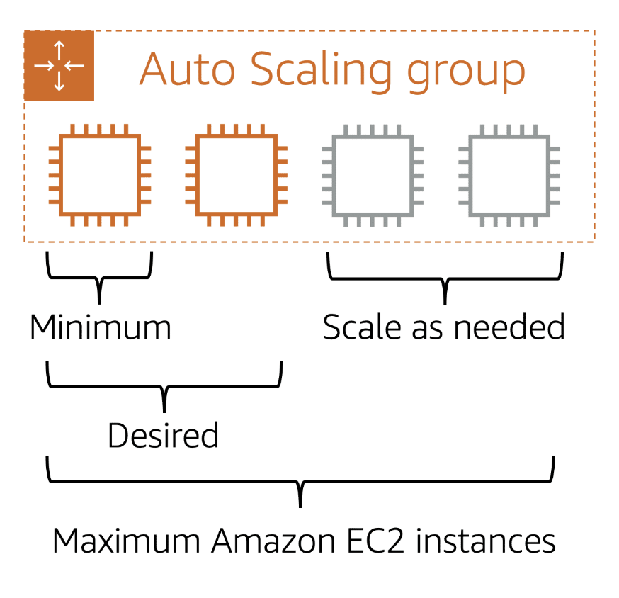

### Elastic Load Balancing (ELB)
Elastic Load Balancing is the AWS service that automatically distributes incoming application traffic across multiple resources, such as Amazon EC2 instances. This helps to ensure that no single resource becomes overutilized.
Although Elastic Load Balancing and Amazon EC2 Auto Scaling are separate services, they work together to help ensure that applications running in Amazon EC2 can provide high performance and availability. 
Scales without no additional extra cost

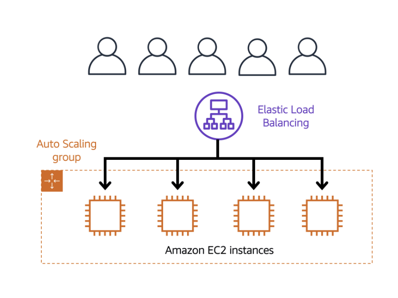

### Messaging and queueing
**_monolithic approach_** have tightly coupled componants are components that are very dependant on each other (if a single component fails, other components fail, and possibly the entire application fails). typical .

**_Microservices_approach_** are loosly coupled where only failure does not affect other componants.

### Amazon Simple Queue Service (SQS).
Message Queue model.
You can send, store, and receive messages between software components, without losing messages or requiring other services to be available. In Amazon SQS, an application sends messages into a queue. A user or service retrieves a message from the queue, processes it, and then deletes it from the queue.

### Amazon Simple Notification Service (SNS)
Pub/Sub model. a publisher publishes messages to subscribers. Subscribers can be web servers, email addresses, AWS Lambda functions, or several other options. 

## Serverless Compute Infra
### AWS LAMBDA
The term “_serverless_” means that your code runs on servers, but you do not need to provision or manage these servers. With serverless computing, you can focus more on innovating new products and features instead of maintaining servers.

Another benefit of serverless computing is the flexibility to scale serverless applications automatically. Serverless computing can adjust the applications' capacity by modifying the units of consumptions, such as throughput and memory. 

For example, a simple Lambda function might involve automatically resizing uploaded images to the AWS Cloud. In this case, the function triggers when uploading a new image.

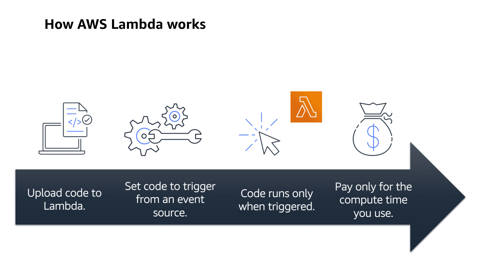

### Containers
Containers provide you with a standard way to package your application's code and dependencies into a single object. You can also use containers for processes and workflows in which there are essential requirements for security, reliability, and scalability.

#### Elastic Container Service (ECS)
Runs on top of EC2 containers, which you manage.
Amazon ECS supports Docker containers. 
AWS supports the use of open-source Docker Community Edition and subscription-based Docker Enterprise Edition. With Amazon ECS, you can use API calls to launch and stop Docker-enabled applications.

#### Amazon Elastic Kubernetes Service (Amazon EKS)
Runs on top of EC2 containers, which you manage.
Fully managed service that you can use to run Kubernetes on AWS. As new features and functionalities release for Kubernetes applications, you can easily apply these updates to your applications managed by Amazon EKS.

#### Amazon Fargate
Underlying OS is managed by AWS. It is the serverless version of ECS / EKS. Fargate is a serverless compute engine for containers. It works with both Amazon ECS and Amazon EKS. You do not need to provision or manage servers. AWS Fargate manages your server infrastructure for you. You can focus more on innovating and developing your applications, and you pay only for the resources that are required to run your containers.
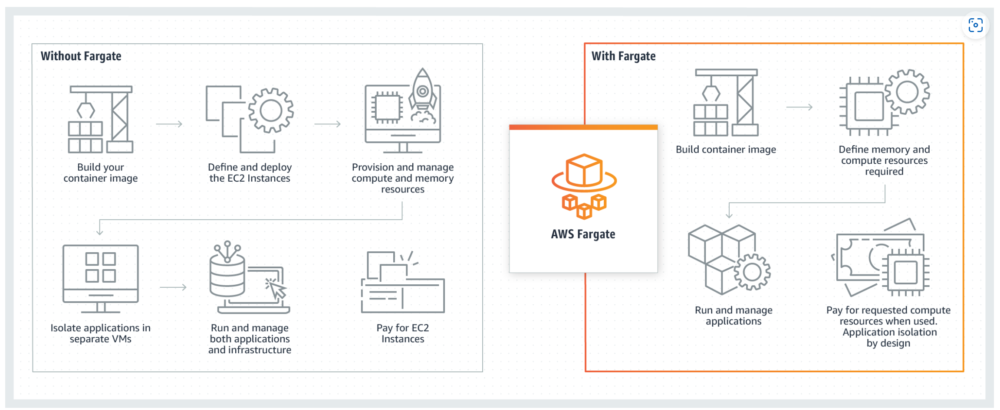

[Hands on Tutorial : Compute](https://aws.amazon.com/getting-started/hands-on/?awsf.getting-started-category=category%23compute&awsf.getting-started-content-type=content-type%23hands-on)

# Global Infra and reliability
## AWS Global Infrastructure

### Regions
Regions connect through hispeed fibre connections. They are geographically isolated.There are 4 Conciderations when choosing a region

    1 - Complience
    
    2 - Proximity
    
    3 - Feature availability
    
    4 - Pricing

### Availability Zones
An Availability Zone is a single data center or a group of data centers **within a Region**. 
These are usually <100Miles in seperation.Availability Zones are located tens of miles apart from each other. This is close enough to have low latency (the time between when content requested and received) between Availability Zones. However, if a disaster occurs in one part of the Region, they are distant enough to reduce the chance that multiple Availability Zones are affected.

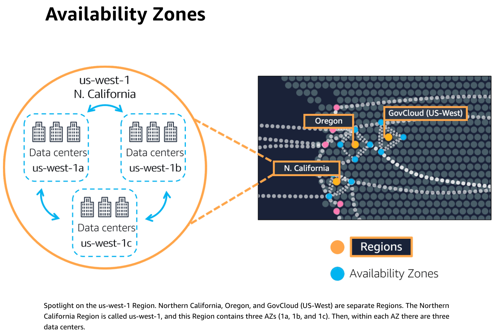
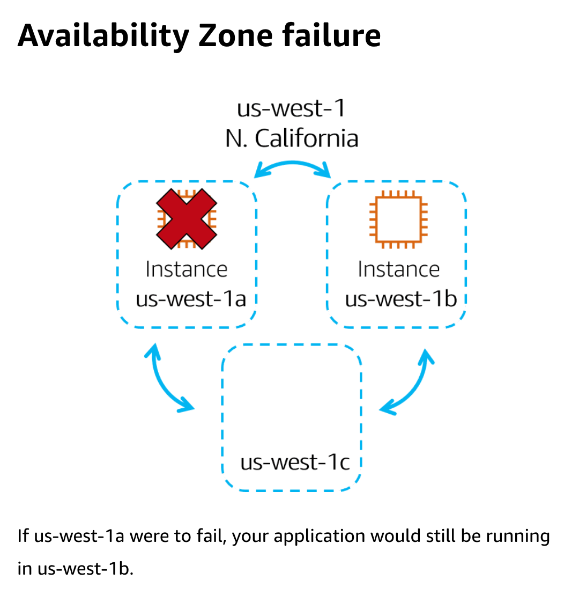

### Data Centres
There are x amount of data centres inside an AZ.

### Edge Locations
**Edge Locations** is a Site that **CloudFront** (Amazons content delivery network) used to store cached copied of you content closer to your customer for faster delivery.
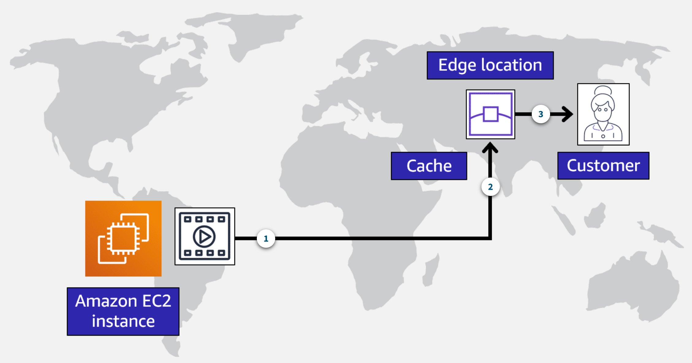

Edge Locations also run a DNS service called **Route 53**.

You can also use **AWS Outposts** that can be installed in your datacenter but owned and operated by AWS. Not all that common.

### Provisioning Resources
Everything in AWS has an API. So there are multiple ways to create resources in AWS.
#### 1- AWS Management Console
The AWS Management Console is a web-based interface for accessing and managing AWS services. You can quickly access recently used services and search for other services by name, keyword, or acronym. The console includes wizards and automated workflows that can simplify the process of completing tasks.

You can also use the AWS Console mobile application to perform tasks such as monitoring resources, viewing alarms, and accessing billing information. Multiple identities can stay logged into the AWS Console mobile app at the same time.

#### 2- AWS CLI
To save time when making API requests, you can use the AWS Command Line Interface (AWS CLI). AWS CLI enables you to control multiple AWS services directly from the command line within one tool. AWS CLI is available for users on Windows, macOS, and Linux. 

By using AWS CLI, you can automate the actions that your services and applications perform through scripts. For example, you can use commands to launch an Amazon EC2 instance, connect an Amazon EC2 instance to a specific Auto Scaling group, and more.

#### 3- AWS SDK
Another option for accessing and managing AWS services is the software development kits (SDKs). SDKs make it easier for you to use AWS services through an API designed for your programming language or platform. SDKs enable you to use AWS services with your existing applications or create entirely new applications that will run on AWS.

To help you get started with using SDKs, AWS provides documentation and sample code for each supported programming language. Supported programming languages include C++, Java, .NET, and more.

#### 4- Other tooling
##### Elastic Beanstalk
Instead of individually provisioning EC2 instances you can use AWS Elastic Beanstalk, you provide **code** and **desired configuration settings**, and Elastic Beanstalk deploys the resources necessary to perform the following tasks:

    -Adjust capacity

    -Load balancing

    -Automatic scaling

    -Application health monitoring

You can save the configuration and then replicate it in another region.
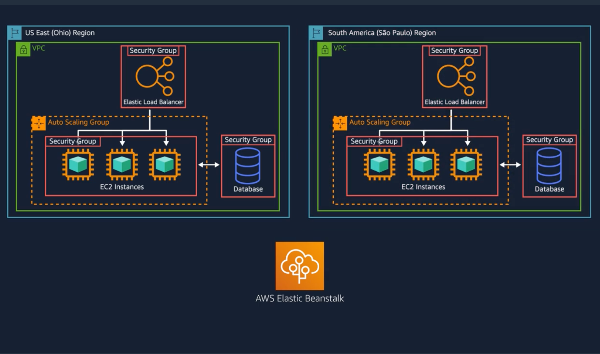

##### CloudFormation
A global content delivery service and IaC tool. Declerative Json or yaml format (Cloud formation template). This does more than just EC2 resources, it does many others aswell (storage, db ML etc). Define what you want and CloudFormation builds out what you want. It determines the right operations to perform when managing your stack and rolls back changes automatically if it detects errors.
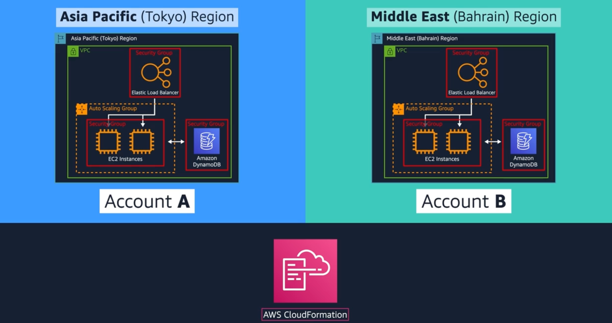

# Networking
## Virtual Private Cloud(VPC)
Define your own private ip range that can be grouped into subnets, some can be public available if required.

To allow public traffic you need an **Internet gateway**, which would look like this:
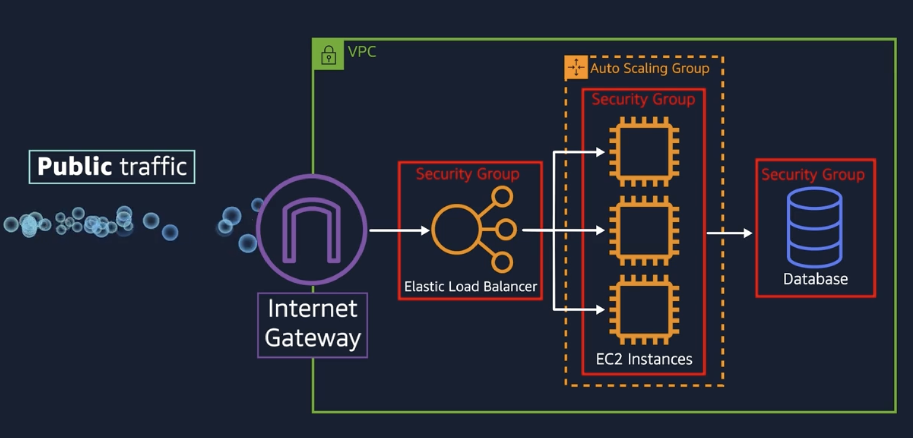

You can make it only accessable from your corporate network by using a **Virtual Private Gateway** The blue server on the left is you internal corporate network. All public traffic is blocked:
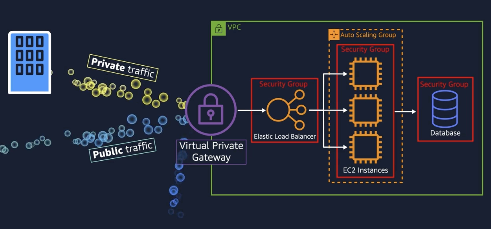
While private and encrypted, they still use a regular internet connection, are therefore suceptable to traffic issues.

This is where **AWS Direct Connect** helps.
This is a dedicated connection over a local telco provider where you select your desired bandwidth.

[Amazon Virtual Private Cloud](https://aws.amazon.com/vpc/)

### Subnets and Network ACLS

