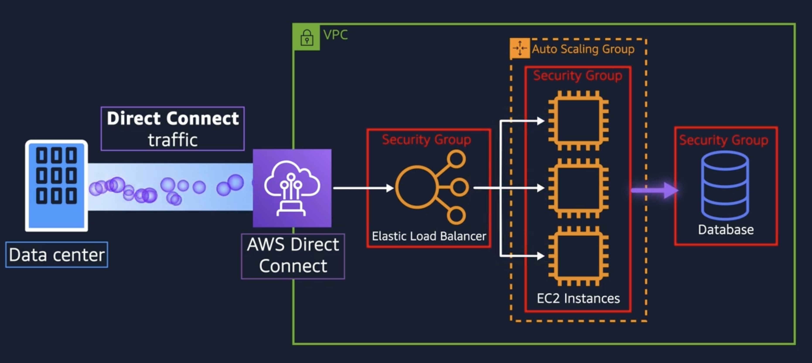

<!-- TOC tocDepth:2..3 chapterDepth:2..6 -->

- [AWS Cloud Practitioner Essentials](#aws-cloud-practitioner-essentials)
  - [Definitions](#definitions)
- [Compute in the Cloud](#compute-in-the-cloud)
  - [Amazon EC2](#amazon-ec2)
    - [Benefits](#benefits)
    - [Instances](#instances)
    - [Purchase Options](#purchase-options)
    - [Scaling Options](#scaling-options)
    - [Elastic Load Balancing (ELB)](#elastic-load-balancing-elb)
    - [Messaging and queueing](#messaging-and-queueing)
    - [Amazon Simple Queue Service (SQS).](#amazon-simple-queue-service-sqs)
    - [Amazon Simple Notification Service (SNS)](#amazon-simple-notification-service-sns)
  - [Serverless Compute Infra](#serverless-compute-infra)
    - [AWS LAMBDA](#aws-lambda)
    - [Containers](#containers)
- [Global Infra and reliability](#global-infra-and-reliability)
  - [AWS Global Infrastructure](#aws-global-infrastructure)
    - [Regions](#regions)
    - [Availability Zones](#availability-zones)
    - [Data Centres](#data-centres)
    - [Edge Locations](#edge-locations)
    - [Provisioning Resources](#provisioning-resources)
- [Networking](#networking)
  - [Virtual Private Cloud(VPC)](#virtual-private-cloudvpc)
    - [Subnets and Network ACLS](#subnets-and-network-acls)
  - [Security Groups vs. Network ACL](#security-groups-vs-network-acl)
    - [**Security Groups** (Instance-Level)](#security-groups-instance-level)
    - [**Network ACLs** (Subnet-Level)](#network-acls-subnet-level)
  - [Default vs. Custom Network ACLs](#default-vs-custom-network-acls)
  - [Global Network](#global-network)
    - [Route 53 (Amazon DNS)](#route-53-amazon-dns)
- [Storage and Databases](#storage-and-databases)
  - [Instance Stores vs Elastic Block Store (EBS)](#instance-stores-vs-elastic-block-store-ebs)
    - [Key Points about EBS:](#key-points-about-ebs)
    - [Alternative Storage: Amazon EFS](#alternative-storage-amazon-efs)
  - [Amazon S3 (Simple Storage Service)](#amazon-s3-simple-storage-service)
    - [S3 Standard (99.999999999 probabilty of)](#s3-standard-99999999999-probabilty-of)
- [AWS Accounts](#aws-accounts)
  - [AWS root account](#aws-root-account)
  - [Accessing AWS with IAM](#accessing-aws-with-iam)

<!-- /TOC -->
# AWS Cloud Practitioner Essentials
## Definitions
| Term                          | Definition                                                                 |
|-------------------------------|----------------------------------------------------------------------------|
| AWS (Amazon Web Services)     | A comprehensive and evolving cloud computing platform provided by Amazon. |
| CIDR (Classless Interdomain Routing) | CIDR is an internet protocol address allocation and route aggregation methodology. |
| Client Side Enctyption | This is the act of encrypting your data locally to help ensure its security in transit and at rest. |
| Durability | This term refers to a system's ability to perform its responsibilities over time, even when unexpected events can occur. For example, Amazon S3 is designed for 99.999999999 percent data durability.|
| Access Control Lists(ACL)     | An ACL is a document that defines who can access a particular bucket or object. Each bucket and object in Amazon Simple Storage Service (Amazon S3) has an ACL. This document defines what each type of user can do, such as write and read permissions.|
| Cloud Computing               | The on-demand delivery of IT resources over the Internet with pay-as-you-go pricing. |
| Region                        | A geographical area containing multiple AWS Availability Zones. Regional services are services that AWS has built on top of multiple Availability Zones so that you don’t have to figure out how to make the best use of zonal services. Regional services only require the assignment of a Region. They use the independence and redundancy of Availability Zones to minimize infrastructure failure. Some services, such as Amazon Simple Storage Service (Amazon S3), do not reside within an Availability Zone. They are called Regional services.          |
| Availability Zone (AZ)        | One or more discrete data centers with redundant power and networking.  It is designed to provide inexpensive, low-latency network connectivity to other Availability Zones in the same Region.   |
| Edge Location                 | A site that AWS uses to cache content closer to users, used in services like CloudFront. |
| Edge Services                 | A service of bringing compute, storage, and other resources closer to the devices and users that are generating and consuming the data. |
| AWS Local Zones | These extend AWS infrastructure by placing compute, storage, database, and other select services closer to large metropolitan areas. This reduces latency for applications that require it. |
| AWS Outposts | These bring AWS services to your on-premises location, but they're not designed for general proximity to large urban centers.|
| IAM (Identity and Access Management) | A service for managing access to AWS services and resources securely.  |
| EC2 (Elastic Compute Cloud)   | A web service that provides resizable compute capacity in the cloud.       |
| S3 (Simple Storage Service)   | An object storage service that offers scalability, data availability, and security. |
| RDS (Relational Database Service) | A managed relational database service supporting multiple database engines. |
| Lambda                        | A serverless compute service that runs code in response to events.        |
| CloudFormation                | A service for modeling and setting up AWS resources using templates.      |
| Auto Scaling                  | A service that automatically adjusts compute capacity to maintain performance. |
| Elastic Load Balancing (ELB)  | A service that automatically distributes incoming application traffic.    |
| AWS Global Infrastructure     | The physical components (Regions, AZs, Edge Locations) of AWS.            |
| CloudFront                    | A fast content delivery network (CDN) service.                            |
| AWS Trusted Advisor           | A tool that provides real-time guidance to help provision resources.      |
| AWS Well-Architected Framework | A set of best practices to help build secure, high-performing, resilient, and efficient infrastructure. |
| Pricing Calculator            | A tool for estimating the cost of AWS services.                          |
| Support Plans                 | Tiered support offerings for AWS customers (Basic, Developer, Business, Enterprise). |
| Shared Responsibility Model   | A model defining AWS and customer responsibilities in the cloud.          |
| Hypervisor                    | Software that creates and runs virtual machines by abstracting hardware resources. |
| Tenant                        | A single customer or user group using a shared computing resource.         |
| Multitenancy                  | An architecture where multiple tenants share the same physical resources while maintaining data isolation. |
| Edge Location                 | An edge location is a data center that an AWS service uses to perform service-specific operations. Edge locations are examples of points of presence (PoPs) in the global edge network |
| Elasticity                        | This is the ability to acquire resources as you need them and to release resources when you no longer need them. In the cloud, you want to do this automatically.  |   
| Gateway                        | A gateway is a device or node that connects two different networks by translating communications from one protocol to another.  |  
| Server-Side Encryption (SSE)   | SSE is the encryption of data at its destination by the application or service that receives it |  
| Zonal Services  | Zonal services require the assignment of a Region and an Availability Zone. |  
| Well-Architected Framework   | The AWS Well-Architected Framework provides best practices and design principles to use as guidelines to build better architecture in the cloud. |  
| Cloud Adoption Framework   | The platform perspective helps build an enterprise-grade, scalable, hybrid cloud platform, modernize existing workloads, and implement new cloud-focused solutions. |  
| Amazon Machine Image (AMI) | is a supported and maintained image provided by AWS that provides the information required to launch an instance. They include 1/+ EBS, OS+aps,Launch perms,block mapping to mount fs |

# Compute in the Cloud
You get different compute models, either **On Prem**, **Hybrid** or **Cloud** models

**Hybrid** is a shared infra model, example:

**Amazon EC2** - Create VM in cloud be rest of the infra is on prem, and customer manages the the EC2 instances

**AWS ELASTIC BEANSTALK** - AWS Elastic Beanstalk is an example of a managed AWS service that takes care of deploying your core infrastructure so you can concentrate on writing the code for your application.

**Fully Managed** - You will still configure and optimize the service for your use case, but you will not be responsible for other traditional management tasks. Amazon DynamoDB is an example of a fully managed service.

## Amazon EC2
Amazon EC2, is a service that lets you run virtual servers in the cloud. Customers who deploy an Amazon Elastic Compute Cloud (Amazon EC2) instance are responsible for managing the guest operating system (including updates and security patches). If you have applications that you want to run in Amazon EC2, you must do the following:

1- Provision instances (virtual servers).

2- Upload your code.

3- Continue to manage the instances while your application is running.

If you are only interested in the Application part, and dont want to manage the infra this is [Serverless Compute Infra](#serverless-compute-infra).

### Benefits
1- Trade fixed expense for variable expence. (Use what you consume)
  
2- Economies of scale (Many users = lower pay as you go prices)

3- Stop guessing about capacity needs (dynamic scalling)

4- Increase speed & agility (Quick to innovate)

5- Focus on your business, not hardware

6- Deploy instantly anywhere in the world for minimal cost

### Instances
**General Pupose** : General purpose instances provide a balance of compute, memory, and networking resources. This instance family would not be the best choice for the application in this scenario. Compute optimized instances are more well suited for batch processing workloads than general purpose instances.

**Memory optimized** instances are more ideal for workloads that process large datasets in memory, such as high-performance databases.

**Storage optimized** instances are designed for workloads that require high, sequential read and write access to large datasets on local storage. The question does not specify the size of data that will be processed. Batch processing involves processing data in groups. A compute optimized instance is ideal for this type of workload, which would benefit from a high-performance processor.

**Compute optimized** instances are ideal for compute bound applications that benefit from high performance processors. Instances belonging to this category are well suited for batch processing workloads, media transcoding, high performance web servers, high performance computing (HPC), scientific modeling, dedicated gaming servers and ad server engines, machine learning inference and other compute intensive applications.

**Accelerated Computing** 
Accelerated computing instances use hardware accelerators, or co-processors, to perform functions, such as floating point number calculations, graphics processing, or data pattern matching, more efficiently than is possible in software running on CPUs.

**HPC Optimized**
High performance computing (HPC) instances are purpose built to offer the best price performance for running HPC workloads at scale on AWS. HPC instances are ideal for applications that benefit from high-performance processors such as large, complex simulations and deep learning workloads.

### Purchase Options
| Plan                          | Definition                                                                 |
|-------------------------------|----------------------------------------------------------------------------|
| On Demand     | Short-term, unpredictable workloads. Pay per hour/sec, this can provide you with a baseline. no longterm commitment |
| Savings Plan    | Long-term, consistent workloads. Low prices with hourly spend commitment for 1 or 3 year term (save 72%) |
| Standard Reserved Instance | Steady state workloads. This option is a good fit if you know the EC2 instance type and size you need for your steady-state applications and in which AWS Region you plan to run them. 3 payment options(full, partial, no upfront cost). Reserved Instances require a contract length of either 1 year or 3 years. (save up to 75%) |
| Convertable Reserved Instance | Steady state workloads. If you need to run your EC2 instances in different Availability Zones or different instance types. 3 payment options(full, partial, no upfront cost), (save up to 75%) |
| Spot Instances | Short-lived, fault-tolerant, flexible workloads. AWS provide 2min warning before reclamation (save up to 90%) |
| Dedicated hosts | 	Regulatory or licensing needs. Physical servers with Amazon EC2 instance capacity that is fully dedicated to your use. (Most expensive) and run in a Virtual Private Cloud(VPC) |

### Scaling Options

Scalability means starting with only the resources you need and allowing your architecture to automatically adjust to changes in demand—**scaling out** (adding resources) or **scaling in** (removing them). This approach ensures that:

- You only pay for what you use.
- You always have enough computing power to meet customer demand.

#### Types of Scaling

| **Plan**              | **Description**                                                                 |
|-----------------------|----------------------------------------------------------------------------------|
| **Dynamic Scaling**   | Automatically responds to real-time changes in demand.                          |
| **Predictive Scaling**| Uses machine learning to forecast traffic and schedule EC2 instances accordingly. |

---

### Auto Scaling

In the cloud, computing power is a **programmable resource**, allowing you to scale more flexibly. With **Amazon EC2 Auto Scaling**, you can:

- Add instances when demand increases.
- Remove instances when they’re no longer needed.

This ensures optimal performance and cost-efficiency.

#### Auto Scaling Group

An **Auto Scaling group** defines the rules for launching and managing EC2 instances. When you create one, you can set:

- A **minimum capacity**, which is the number of EC2 instances launched right away.
- Automatic scaling behavior based on demand.

📌 *Example:* If your group has a minimum capacity of 1 EC2 instance, it launches immediately and can scale based on your configuration.

You only pay for the instances while they’re running.

### Elastic Load Balancing (ELB)
Elastic Load Balancing is the AWS service that automatically distributes incoming application traffic across multiple resources, such as Amazon EC2 instances. This helps to ensure that no single resource becomes overutilized.
Although Elastic Load Balancing and Amazon EC2 Auto Scaling are separate services, they work together to help ensure that applications running in Amazon EC2 can provide high performance and availability. 
Scales without no additional extra cost

### Messaging and queueing
**_monolithic approach_** have tightly coupled componants are components that are very dependant on each other (if a single component fails, other components fail, and possibly the entire application fails). typical .

**_Microservices_approach_** are loosly coupled where only failure does not affect other componants.

### Amazon Simple Queue Service (SQS).
Message Queue model.
You can send, store, and receive messages between software components, without losing messages or requiring other services to be available. In Amazon SQS, an application sends messages into a queue. A user or service retrieves a message from the queue, processes it, and then deletes it from the queue.

### Amazon Simple Notification Service (SNS)
Pub/Sub model. a publisher publishes messages to subscribers. Subscribers can be web servers, email addresses, AWS Lambda functions, or several other options. 

## Serverless Compute Infra
### AWS LAMBDA
The term “_serverless_” means that your code runs on servers, but you do not need to provision or manage these servers. With serverless computing, you can store code on an S3 instance and then at run time they are allocated comput power, and then give it back afterwards. You only pay for the compute time your code actually uses. Meaning you can focus more on innovating new products and features instead of maintaining servers.

Another benefit of serverless computing is the flexibility to scale serverless applications automatically. Serverless computing can adjust the applications' capacity by modifying the units of consumptions, such as throughput and memory. 

For example, a simple Lambda function might involve automatically resizing uploaded images to the AWS Cloud. In this case, the function triggers when uploading a new image.

### Containers
Containers provide you with a standard way to package your application's code and dependencies into a single object. You can also use containers for processes and workflows in which there are essential requirements for security, reliability, and scalability.

#### Elastic Container Service (ECS)
Runs on top of EC2 containers, which you manage.
Amazon ECS supports Docker containers. 
AWS supports the use of open-source Docker Community Edition and subscription-based Docker Enterprise Edition. With Amazon ECS, you can use API calls to launch and stop Docker-enabled applications.

#### Amazon Elastic Kubernetes Service (Amazon EKS)
Runs on top of EC2 containers, which you manage.
Fully managed service that you can use to run Kubernetes on AWS. As new features and functionalities release for Kubernetes applications, you can easily apply these updates to your applications managed by Amazon EKS.

#### Amazon Fargate
Underlying OS is managed by AWS. It is the serverless version of ECS / EKS. Fargate is a serverless compute engine for containers. It works with both Amazon ECS and Amazon EKS. You do not need to provision or manage servers. AWS Fargate manages your server infrastructure for you. You can focus more on innovating and developing your applications, and you pay only for the resources that are required to run your containers.

[Hands on Tutorial : Compute](https://aws.amazon.com/getting-started/hands-on/?awsf.getting-started-category=category%23compute&awsf.getting-started-content-type=content-type%23hands-on)

# Global Infra and reliability
## AWS Global Infrastructure

### Regions
Regions connect through hispeed fibre connections. They are geographically isolated.There are 4 Conciderations when choosing a region. There are 33 Regions(2024)

    1 - Compliance(Government/Legal)
    
    2 - Proximity
    
    3 - Feature availability
    
    4 - Pricing

### Availability Zones
An Availability Zone (logical construct) is a single data center or a group of data centers **within a Region**. 
These are usually <60Miles(100Km) in seperation.Availability Zones are located tens of miles apart from each other. This is close enough to have low latency (single digit ms) (the time between when content requested and received) between Availability Zones. However, if a disaster occurs in one part of the Region, they are distant enough to reduce the chance that multiple Availability Zones are affected.

All Availability Zones in a Region interconnect through high-bandwidth, low-latency, redundant metro fiber networks. Each Availability Zone connects to 

Note: Naming convention (appended 1a/1b/1c) are the availability Zones in region (US-West-1).

### Data Centres
There are x amount of data centres inside an AZ which is in that region(US-West-1).

### Edge Locations
**Edge Locations** is a Site that **CloudFront** (Amazons content delivery network) used to store cached copied of you content closer to your customer for faster delivery.

Edge Locations also run a DNS service called **Route 53**.

You can also use **AWS Outposts** that can be installed in your datacenter but owned and operated by AWS. Not all that common.

#### Benefits of Edge Computing

##### ✅ 1-Reduced Latency
By processing data closer to the source, edge computing significantly reduces the time it takes for data to travel between a device and the cloud.  
This results in **faster response times** and a **better user experience**.

##### ✅ 2-Improved Reliability
Edge computing can continue to operate even when the connection to the cloud is disrupted.  
This provides **greater service availability and resilience**.

##### ✅ 3-Reduced Bandwidth Usage
Processing data locally at the edge reduces the volume of data sent to the cloud.  
This helps with **cost savings** and more **efficient use of network resources**.

##### ✅ 4-Enhanced Security and Privacy
Sensitive data can be processed locally rather than transmitted to a centralized cloud.  
This enhances **data privacy** and **security compliance**.

### Provisioning Resources
Everything in AWS has an API. So there are multiple ways to create resources in AWS.
#### 1- AWS Management Console
The AWS Management Console is a web-based interface for accessing and managing AWS services. You can quickly access recently used services and search for other services by name, keyword, or acronym. The console includes wizards and automated workflows that can simplify the process of completing tasks.

You can also use the AWS Console mobile application to perform tasks such as monitoring resources, viewing alarms, and accessing billing information. Multiple identities can stay logged into the AWS Console mobile app at the same time.

#### 2- AWS CLI
To save time when making API requests, you can use the AWS Command Line Interface (AWS CLI). AWS CLI enables you to control multiple AWS services directly from the command line within one tool. AWS CLI is available for users on Windows, macOS, and Linux. 

By using AWS CLI, you can automate the actions that your services and applications perform through scripts. For example, you can use commands to launch an Amazon EC2 instance, connect an Amazon EC2 instance to a specific Auto Scaling group, and more.

#### 3- AWS SDK
Another option for accessing and managing AWS services is the software development kits (SDKs). SDKs make it easier for you to use AWS services through an API designed for your programming language or platform. SDKs enable you to use AWS services with your existing applications or create entirely new applications that will run on AWS.

To help you get started with using SDKs, AWS provides documentation and sample code for each supported programming language. Supported programming languages include C++, Java, .NET, and more.

#### 4- Other tooling
##### Elastic Beanstalk
Instead of individually provisioning EC2 instances you can use AWS Elastic Beanstalk, you provide **code** and **desired configuration settings**, and Elastic Beanstalk deploys the resources necessary to perform the following tasks:

    -Adjust capacity

    -Load balancing

    -Automatic scaling

    -Application health monitoring

You can save the configuration and then replicate it in another region.

##### CloudFormation
A global content delivery service and IaC tool. Declerative Json or yaml format (Cloud formation template). This does more than just EC2 resources, it does many others aswell (storage, db ML etc). Define what you want and CloudFormation builds out what you want. It determines the right operations to perform when managing your stack and rolls back changes automatically if it detects errors.

# Networking
## Virtual Private Cloud(VPC)
Define your own private ip range that can be grouped into subnets, some can be public available if required.

To allow public traffic you need an ! **Internet gateway** !, which would look like this:

You can make it only accessable from your corporate network by using a **Virtual Private Gateway** (VPN over internet). The blue server on the left is you internal corporate network. All public traffic is blocked:

While private and encrypted, they still use a regular internet connection, are therefore suceptable to traffic issues.

This is where **AWS Direct Connect** helps.
This is a dedicated connection over a local telco provider where you select your desired bandwidth.

[Amazon Virtual Private Cloud](https://aws.amazon.com/vpc/)

### Subnets and Network ACLS
A **subnet** is a section of a VPC in which you can group resources based on security or operational needs. Subnets can be public or private. 

#### Public subnets
 contain resources that need to be accessible by the public, such as an online store’s website.

#### Private subnets

Some resources—such as databases containing customer information and order history—should only be accessible through your private network.

In an AWS Virtual Private Cloud (VPC), subnets can communicate with each other. For example, EC2 instances in a **public subnet** might need to interact with a **database in a private subnet**.

## Security Groups vs. Network ACL

### **Security Groups** (Instance-Level)
- Use **stateful packet filtering**: they remember previously allowed traffic
- Example: If an EC2 instance initiates a request to the internet, the security group allows the response back—even if no specific inbound rule exists for it.

### **Network ACLs** (Subnet-Level)
- Use **stateless packet filtering**: each packet is checked individually, both inbound and outbound.
- They do not remember previous traffic, so both directions must be explicitly allowed.
- Each subnet can be associated with one network ACL.

## Default vs. Custom Network ACLs

- Every AWS account includes a **default network ACL** that allows all inbound and outbound traffic.
- When you create a **custom network ACL**, all traffic is **denied by default** until you explicitly add rules to allow it.
- All ACLs include an **explicit deny rule** at the end, which blocks any traffic that doesn't match existing allow rules.

**Below is an example of how Security Groups and NACL's work together:** 

## Global Network
### Route 53 (Amazon DNS)
Route 53 allows you to purchase domains and manage then. It can also
 perform various routing policies like;

    1 - Latency-based routing

    2 - Geolocation DNS

    3 - Geoproximity routing

    4 - Weighted round robin 

**Cloudfront and Route 53 example:**

*Suppose that AnyCompany’s application is running on several Amazon EC2 instances. These instances are in an Auto Scaling group that attaches to an Application Load Balancer*

1) A customer requests data from the application by going to AnyCompany’s website. 

2) Amazon Route 53 uses DNS resolution to identify AnyCompany.com’s corresponding IP address, 192.0.2.0. This information is sent back to the customer. 

3) The customer’s request is sent to the nearest edge location through Amazon CloudFront. 

4) Amazon CloudFront connects to the Application Load Balancer, which sends the incoming packet to an Amazon EC2 instance.

# Storage and Databases
## Instance Stores vs Elastic Block Store (EBS)

Some **EC2** virtual machines (VMs) can use **Instance Store Volumes**. It's important to note that:

- **Instance store volumes are temporary.**  
  If the EC2 instance is stopped or terminated, **data stored on instance store volumes will be lost**.

To persist data even after shutdown or termination, you should use **Elastic Block Store (EBS)** volumes instead.

### Key Points about EBS:
- **EBS volumes are persistent** and remain available even if the EC2 instance is stopped.
- Each EBS volume has a unique **volume ID**.
- EBS volumes are **separate from the host computer** (they are network-attached storage).
- **GP3** is one of the EBS volume types, offering a balance of performance and cost.

### Alternative Storage: Amazon EFS
- You can also store data entirely in the cloud using **Amazon Elastic File System (EFS)**.
- **Amazon EFS** provides **scalable file storage** that can be shared across multiple EC2 instances.

EBS volumes can be backed-up using EBS snapshots. Basically a full backup with incremental snapshot thereafter.

## Amazon S3 (Simple Storage Service)
This is a service that provides object-level storage. Amazon S3 stores data as objects in buckets. Max size for 1 object is 5TB! It also has versioning included.

***Block storage***  = modification means only the pieces that are changed are updated. 

***Object storage*** = modification means the entire object is updated.

In object storage, each object consists of 
 - DATA      (image,video etc)
 - METADATA  (type/size etc.)
 - KEY       (Unique ID)

  

The data might be an image, video, text document, or any other type of file. Metadata contains information about what the data is, how it is used, the object size, and so on. An object’s key is its unique identifier.

### S3 Storage Classes
Two Important Conciderations:

 1 - How often you plan to retrieve your data?

 2 - How available you need your data to be?

| **Storage Class**               | **Best For**                                   | **Availability**           | **Key Features**                                                                 | **Cost**                          |
|---------------------------------|------------------------------------------------|-----------------------------|----------------------------------------------------------------------------------|-----------------------------------|
| S3 Standard                     | Frequently accessed data                       | 3+ Availability Zones       | High availability; good for websites, content delivery, analytics               | Higher cost                       |
| S3 Standard-IA                  | Infrequently accessed data                     | 3+ Availability Zones       | Lower storage, higher retrieval cost; high availability                         | Lower than Standard               |
| S3 One Zone-IA                  | Infrequently accessed, reproducible data       | Single Availability Zone    | Cheapest IA option; not resilient to AZ failure                                 | Lower than Standard-IA            |
| S3 Intelligent-Tiering          | Unknown or changing access patterns            | 3+ Availability Zones       | Auto-moves data between tiers based on access patterns                          | Monitoring fee + tiered pricing   |
| S3 Glacier Instant Retrieval    | Archived data that needs fast access           | 3+ Availability Zones       | Retrieves in milliseconds; archival + fast access                               | Low                               |
| S3 Glacier Flexible Retrieval   | Low-cost archiving with moderate access needs  | 3+ Availability Zones       | Retrieves in minutes to hours                                                   | Lower                             |
| S3 Glacier Deep Archive         | Long-term archival, rarely accessed            | 3+ Availability Zones       | Retrieves in 12–48 hours; lowest cost                                           | Lowest                            |
| S3 Outposts                     | On-premises object storage needs               | On-prem via AWS Outposts    | Keeps data local for low-latency, compliance                                    | Depends on Outposts setup         |

# AWS Accounts
## AWS root account
The root user is accessed by signing in with the email address and password that you used to create your AWS account. It has complete access to all the AWS services and resources in the account.

Do not use the root user for everyday tasks. Instead, use the root user to create the first AWS Identity and Access Management (IAM) user and assign it permissions to create other users. Only use the root user when you need to perform a limited number of tasks that are only available to the root user. Examples of these tasks include changing the root user email address and changing your AWS Support plan.

## Accessing AWS with IAM
These user accounts can be created for your employees, partners, or even automated systems that need to interact with your AWS services. Each user account has its own set of credentials, such as a username and password, which are used to authenticate access to the AWS account.

# Accounts and Billing
## AWS Free Tier Categories

1. **Always Free**
   - No expiration; available to all AWS customers.
   - Examples:
     - **AWS Lambda**: 1M free requests and 3.2M compute seconds/month.
     - **Amazon DynamoDB**: 25 GB of free storage/month.

2. **12-Month Free**
   - Available for 12 months after initial AWS sign-up.
   - Examples:
     - **Amazon EC2**: Limited hours/month.
     - **Amazon S3**: Standard storage.
     - **Amazon CloudFront**: Data transfer out.

3. **Free Trials**
   - Limited-time offers starting on service activation.
   - Examples:
     - **Amazon Inspector**: 90-day free trial.
     - **Amazon Lightsail**: 750 free hours over 30 days.

---

## AWS Pricing Models

- **On-Demand Instances**
  - Pay per hour/second.
  - No long-term commitment or upfront payment.

- **Savings Plans**
  - Commit to consistent usage ($/hour) for 1 or 3 years.
  - Covers EC2, Lambda, Fargate, and SageMaker.
  - Offers significant discounts.

- **Spot Instances**
  - Buy spare EC2 capacity at up to 90% discount.
  - No upfront commitment.

- **Reserved Instances**
  - Pay upfront to reserve capacity.
  - Up to 75% discount compared to On-Demand pricing.

---

## Cost Allocation Tags

- Tags are labels (e.g., `Project=App1`, `Env=Dev`) applied to resources.
- Help categorize and track AWS costs.
- Allow cost breakdowns by department, project, or team.
- Support **chargeback** and **showback** models.
- Encourage consistent tagging and compliance checking.

---

## AWS Cost Management Tools

- **AWS Billing Conductor**
  - Custom billing and cost allocation across accounts.
  - Specifically designed for custom billing and chargeback use cases. 
  - Helps understand cost drivers.

- **AWS Cost Explorer**
  - Visualizes cost and usage trends.
  - Forecasts future costs.
  - Identifies optimization opportunities.

- **AWS Cost and Usage Reports (CUR)**
  - Detailed reports (by hour, tag, service, etc.).
  - Supports custom analysis and reporting.

- **AWS Budgets**
  - Set alerts for cost or usage thresholds.
